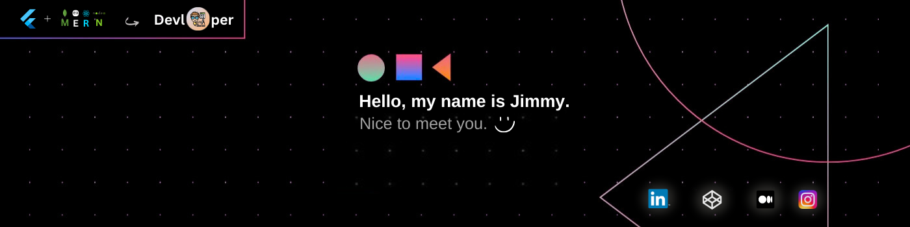
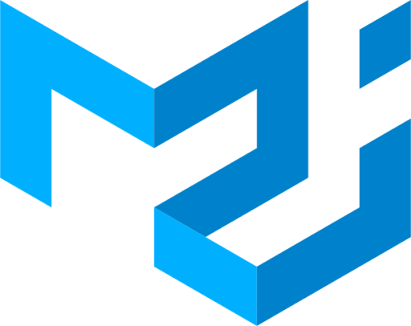

<!--- <h1 align="center">Hello 👋, I'm Jimmy Ramani</h1> -->
<h1 align="center"></h1>

<h3 align="justify">Passionate tech enthusiast skilled in web and app development, with a focus on creating engaging and innovative digital experiences.</h3>

## 👨🏼‍💻 About Me :

- 👨‍💻 I'm on an exciting journey as a Full Stack Developer @ **[Softrefine Technology Pvt Ltd.](https://softrefine.com/)** , where I bring creativity and innovation to the tech realm.
-  **What Sparks My Enthusiasm**
  - 📊 Web Development with **ReactJS, NodeJS, ExpressJS, MongoDB**
  - 📱 Mobile Apps Magic with **Flutter**
  - 🌐 Creating Cloud Symphony: **AWS, Docker, Jenkins, Kubernetes, Terraform**
- 🪖 Giving solution of problems on [Stack Overflow](https://stackoverflow.com/users/23302913/jimmy-ramani).
- 📰 Contributing insights on [LinkedIn](https://www.linkedin.com/in/jimmyramani/). Check out my contributed articles.
- 💻 Check out my design experiments on [CodePen](https://codepen.io/jimmyramani).
- 📙 Explore my [Resume](https://drive.google.com/file/d/1nI1WcgH36h1UZ1DWl8w_t4ADq_ECTfCz/view?usp=sharing). Let's make it a page-turner!
- 🚀 **Innovative Projects:** Creating something cool that adds value.
- 📚 **Continuous Learning:** Always hungry for the next challenge.
- 💬 Ask me about anything tech related, Need tech insights? I am happy to help!

### 📬 Find me at :
      

## 💻 Tech Stack :

### Languages 🚀
> Proficient in various languages, including:

<table>
  <tr>
  <td align="center" width="96">
      
       C
    </td>
    <td align="center" width="96">
      
       C++
    </td>
    <td align="center" width="96">
      
       HTML
    </td>
    <td align="center" width="96">
      
       CSS
    </td>
    <td align="center" width="96">
      
       JavaScript
    </td>
    <td align="center" width="96">
      
       Typescript
    </td>
    <td align="center"  width="96">
      
       Dart
    </td>
    <td align="center" width="96">
      
       Python
    </td>
  </tr>
</table>

### Frontend 🎨

> Specialize in Frontend technologies like:

<table>
  <tr>
    <td align="center" width="96" margin="10">
      
       React
    </td>
    <td align="center" width="96">
      
       Flutter
    </td>
    <td align="center" width="96">
      
       Sass
    </td>
    <td align="center" width="96">
      
       Tailwind CSS
    </td>
    <td align="center" width="96">
      
       Ant Design
    </td>
    <td align="center" width="96">
      
       Material UI
    </td>
    <td align="center" width="96">
      
       Bootstrap
    </td>
  </tr>
</table>

### Backend 🏬

> Specialize in Backend services like:

<table>
  <tr>
    <td align="center" width="96" margin="10">
      
       NodeJS
    </td>
    <td align="center" width="96">
      
       ExpressJS
    </td>
    <td align="center" width="96">
      
       Firebase
    </td>
  </tr>
</table>

### Databases 🛢️

> Work with various databases, including:

<table>
  <tr>
    <td align="center" width="96" margin="10">
      
       MongoDB
    </td>
    <td align="center" width="96">
      
       MySQL
    </td>
    <td align="center" width="96">
      
       PostgreSQL
    </td>
  </tr>
</table>

## DevOps 🚀

> In the DevOps realm, use services like:

<table>
  <tr>
    <td align="center" width="96" margin="10">
      
       AWS
    </td>
    <td align="center" width="96">
      
       Docker
    </td>
    <td align="center" width="96">
      
       Jenkins
    </td>
    <td align="center" width="96">
      
       Kubernetes
    </td>
    <td align="center" width="96">
      
       Terraform
    </td>
    <td align="center" width="96">
      
       Vagrant
    </td>
  </tr>
</table>

### ORM Tools 🛠️

> Leverage ORM tools such as:

<table>
  <tr>
    <td align="center" width="96">
      
       Mongoose
    </td>
  </tr>
</table>

## DevSetup 🖥️

              

## 📊 GitHub Stats :

